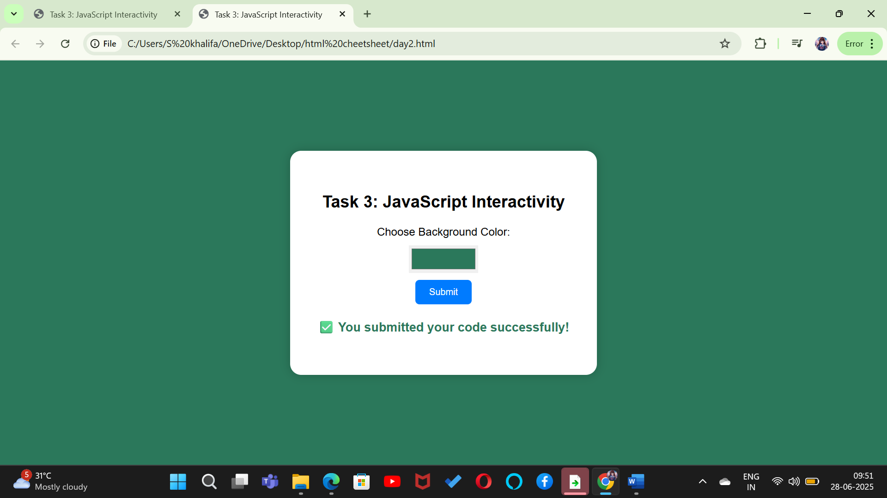

# task3-javascript-interaction-demo
Adds interactivity using JavaScript — color picker, dynamic background update, and success message with styling.
# Task 3 – JavaScript Interactivity 

This project is part of the IBM Front-End Internship (Task 3).  
It demonstrates basic interactivity using **JavaScript**, allowing users to:

-  Select any color from a color picker
-  Instantly change the page background to that color
- Display a success message in the selected color

## 📸 Screenshot

##  Technologies Used
- HTML
- CSS
- JavaScript

##  How to Run
1. Download or clone the repository
2. Open `index.html` in any browser
3. Choose a color and click submit — the background and message will update!

---

*Created by Shaik Khalifa as part of IBM Internship Task 3*

